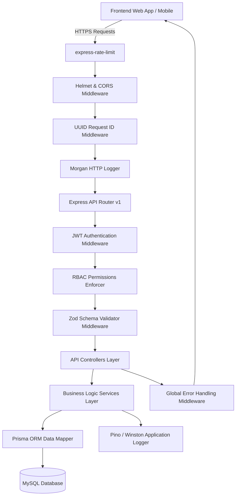
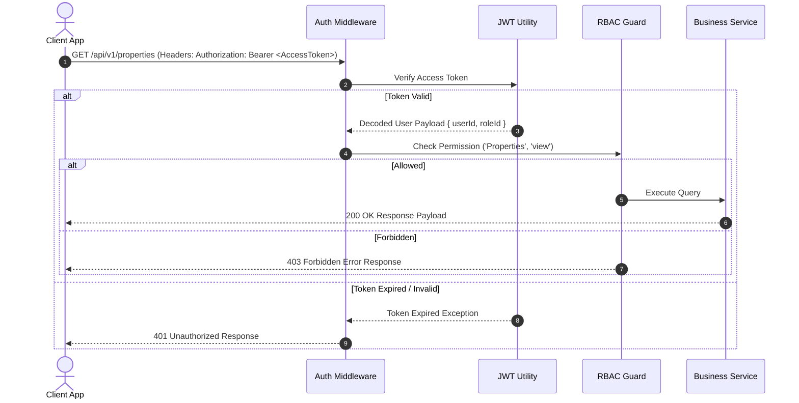

# DoorLoop Property Management ERP - System Architecture

## 1. High-Level Architectural Pattern

The backend follows a **Layered Clean Architecture** pattern with strict separation of concerns between HTTP transport handlers, middleware pipelines, business logic services, data access abstractions (Prisma ORM), and the relational database engine (PostgreSQL).



---

## 2. Component Layer Responsibilities

| Architectural Layer | Core Responsibility | Key Technologies / Code References |
| :--- | :--- | :--- |
| **Transport / Router Layer** | Defines API endpoints, HTTP verbs, and mounts middleware stack. | `src/routes/*` |
| **Security & Middleware Layer** | Validates JWT tokens, verifies user permissions, validates request schemas, logs requests, injects request trace IDs. | `src/middlewares/*`, `jwt.ts`, `zod` |
| **Controller Layer** | Receives request objects, extracts validated parameters, calls service layer, formats HTTP response payload. | `src/controllers/*` |
| **Service Layer** | Implements core business logic, transaction handling, state transitions, ledger calculations, and rules enforcement. | `src/services/*` |
| **Data Access Layer** | Translates service calls into type-safe SQL queries via Prisma ORM. Handles transactions and migrations. | `prisma/schema.prisma`, `src/config/database.ts` |
| **Database Layer** | Stores relational entity tables with foreign keys, constraints, and indexes. | MySQL |

---

## 3. Security Architecture & Middleware Pipeline



### 3.1. Authentication Architecture
- **Dual-Token Pattern**:
  - **Access Token**: Short-lived JWT (e.g., 15 minutes expiration). Sent via `Authorization: Bearer <token>` header. Contains `userId`, `email`, `roleId`, and `companyId`.
  - **Refresh Token**: Long-lived JWT (e.g., 7 days expiration). Stored securely in an `HttpOnly`, `SameSite=Strict`, `Secure` cookie or returned for secure mobile storage. Used at `/api/v1/auth/refresh` to issue new Access Tokens.
- **Password Hashing**: Passwords hashed using `bcrypt` with a salt round factor of `12`.

### 3.2. Authorization & RBAC Mechanics
- Dynamic Permission Matrix per Role (`Dashboard`, `Properties`, `Leasing`, `Tenants`, `Owners`, `Rent & Payments`, `Accounting`, `Maintenance`, `Documents`, `Reports`, `Communication`, `Company Settings`).
- Action capabilities per module: `view`, `create`, `edit`, `delete`, `approve`, `export`.
- User-level granular assignment overrides to restrict property managers to specific property IDs or unit ranges.

### 3.3. Request Hardening
- **Helmet**: Disables `X-Powered-By`, sets `Strict-Transport-Security`, `X-Content-Type-Options`, and `X-Frame-Options`.
- **CORS**: Strict whitelist domain matching against origin header.
- **Rate Limiting**: Configured with `express-rate-limit` (e.g., 100 requests per 15 minutes per IP for general endpoints; 5 requests per 15 minutes for authentication login routes).

---

## 4. Prisma Schema & Database Models Architecture

The backend database schema models all entities from `mockApi.ts`. Below is the representative **Prisma Data Schema (`prisma/schema.prisma`)**:

```prisma
datasource db {
  provider = "postgresql"
  url      = env("DATABASE_URL")
}

generator client {
  provider = "prisma-client-js"
}

// Enum Definitions
enum PropertyType {
  Apartment
  Commercial
  SingleFamily
  MultiFamily
  HOA
}

enum UnitStatus {
  Occupied
  Vacant
  Reserved
  UnderMaintenance
}

enum TenantStatus {
  Active
  Inactive
  Pending
}

enum LeaseStatus {
  Active
  Pending
  Expired
  Terminated
}

enum PaymentStatus {
  Pending
  Paid
  PartiallyPaid
  Failed
  Refunded
  Voided
}

enum PaymentMethod {
  ACH
  CreditCard
  BankTransfer
  Cash
  Check
}

enum WorkOrderStatus {
  Open
  InProgress
  Completed
  Cancelled
}

enum Priority {
  Low
  Normal
  High
  Emergency
}

// 1. User & Security Models
model User {
  id           String       @id @default(uuid())
  email        String       @unique
  passwordHash String
  firstName    String
  lastName     String
  phone        String?
  roleId       String
  role         Role         @relation(fields: [roleId], references: [id])
  status       String       @default("Active")
  lastLogin    DateTime?
  createdAt    DateTime     @default(now())
  updatedAt    DateTime     @updatedAt

  assignments  UserAssignment[]
  auditLogs    AuditLog[]

  @@map("users")
}

model Role {
  id          String       @id @default(uuid())
  name        String       @unique
  description String?
  isCustom    Boolean      @default(false)
  permissions Permission[]
  users       User[]

  @@map("roles")
}

model Permission {
  id        String   @id @default(uuid())
  roleId    String
  role      Role     @relation(fields: [roleId], references: [id], onDelete: Cascade)
  module    String   // e.g. "Properties", "Accounting"
  canView   Boolean  @default(false)
  canCreate Boolean  @default(false)
  canEdit   Boolean  @default(false)
  canDelete Boolean  @default(false)
  canApprove Boolean @default(false)
  canExport Boolean  @default(false)

  @@unique([roleId, module])
  @@map("permissions")
}

model UserAssignment {
  id         String   @id @default(uuid())
  userId     String
  user       User     @relation(fields: [userId], references: [id], onDelete: Cascade)
  propertyId String?
  buildingId String?
  unitId     String?

  @@map("user_assignments")
}

// 2. Core Real Estate Models
model Owner {
  id                   String        @id @default(uuid())
  firstName            String
  lastName             String
  email                String        @unique
  phone                String
  payoutMethod         String        @default("ACH/Direct Deposit")
  propertiesOwnedCount Int           @default(0)
  createdAt            DateTime      @default(now())

  properties           Property[]
  distributions        OwnerDistribution[]

  @@map("owners")
}

model Property {
  id                   String       @id @default(uuid())
  name                 String
  type                 PropertyType
  status               String       @default("Active")
  ownerId              String
  owner                Owner        @relation(fields: [ownerId], references: [id])
  ownershipPercentage  Float        @default(100)
  managementCompany    String       @default("Apex Property Management")
  address              String
  streetAddress        String
  city                 String
  state                String
  country              String       @default("USA")
  zip                  String
  unitsCount           Int          @default(0)
  occupiedUnits        Int          @default(0)
  occupancyRate        Float        @default(0)
  monthlyRevenue       Float        @default(0)
  yearBuilt            Int
  totalBuildings       Int          @default(1)
  squareFootage        Float
  purchasePrice        Float
  currentValue         Float
  monthlyExpenses      Float        @default(0)
  createdAt            DateTime     @default(now())
  updatedAt            DateTime     @updatedAt

  buildings            Building[]
  units                Unit[]
  leases               Lease[]
  rentPayments         RentPayment[]
  workOrders           WorkOrder[]

  @@map("properties")
}

model Building {
  id            String   @id @default(uuid())
  propertyId    String
  property      Property @relation(fields: [propertyId], references: [id], onDelete: Cascade)
  name          String
  floors        Int      @default(1)
  unitsCount    Int      @default(0)
  occupancyRate Float    @default(0)

  units         Unit[]

  @@map("buildings")
}

model Unit {
  id              String     @id @default(uuid())
  propertyId      String
  property        Property   @relation(fields: [propertyId], references: [id], onDelete: Cascade)
  buildingId      String
  building        Building   @relation(fields: [buildingId], references: [id], onDelete: Cascade)
  unitNumber      String
  floor           Int
  bedrooms        Int
  bathrooms       Float
  squareFootage   Float
  rentAmount      Float
  securityDeposit Float
  availabilityDate DateTime
  status          UnitStatus @default(Vacant)

  tenants         Tenant[]
  leases          Lease[]
  rentPayments    RentPayment[]

  @@map("units")
}

model Tenant {
  id           String       @id @default(uuid())
  firstName    String
  lastName     String
  email        String       @unique
  phone        String
  unitId       String?
  unit         Unit?        @relation(fields: [unitId], references: [id])
  status       TenantStatus @default(Pending)
  createdAt    DateTime     @default(now())

  leases       Lease[]
  payments     RentPayment[]

  @@map("tenants")
}

model Lease {
  id            String      @id @default(uuid())
  tenantId      String
  tenant        Tenant      @relation(fields: [tenantId], references: [id])
  propertyId    String
  property      Property    @relation(fields: [propertyId], references: [id])
  unitId        String
  unit          Unit        @relation(fields: [unitId], references: [id])
  startDate     DateTime
  endDate       DateTime
  rentAmount    Float
  depositAmount Float
  status        LeaseStatus @default(Pending)

  payments      RentPayment[]

  @@map("leases")
}

// 3. Billing & Accounting Models
model RentPayment {
  id              String        @id @default(uuid())
  tenantId        String
  tenant          Tenant        @relation(fields: [tenantId], references: [id])
  propertyId      String
  property        Property      @relation(fields: [propertyId], references: [id])
  unitId          String
  unit            Unit          @relation(fields: [unitId], references: [id])
  leaseId         String
  lease           Lease         @relation(fields: [leaseId], references: [id])
  amount          Float
  dueDate         DateTime
  paidDate        DateTime?
  status          PaymentStatus @default(Pending)
  paymentMethod   PaymentMethod
  referenceNumber String?
  createdBy       String        @default("System")

  @@map("rent_payments")
}

model CoAAccount {
  id            String   @id @default(uuid())
  accountCode   String   @unique
  accountName   String
  type          String   // Asset, Liability, Equity, Revenue, Expense
  subType       String?
  balance       Float    @default(0)
  isActive      Boolean  @default(true)

  journalLines  JournalEntryLine[]

  @@map("coa_accounts")
}

model JournalEntry {
  id          String             @id @default(uuid())
  entryNumber String             @unique
  date        DateTime
  description String
  reference   String?
  lines       JournalEntryLine[]

  @@map("journal_entries")
}

model JournalEntryLine {
  id             String       @id @default(uuid())
  journalEntryId String
  journalEntry   JournalEntry @relation(fields: [journalEntryId], references: [id], onDelete: Cascade)
  accountId      String
  account        CoAAccount   @relation(fields: [accountId], references: [id])
  debit          Float        @default(0)
  credit         Float        @default(0)

  @@map("journal_entry_lines")
}

// 4. Maintenance & Operations Models
model Vendor {
  id            String      @id @default(uuid())
  companyName   String
  contactName   String
  email         String
  phone         String
  serviceType   String
  rating        Float       @default(5.0)

  workOrders    WorkOrder[]

  @@map("vendors")
}

model WorkOrder {
  id           String          @id @default(uuid())
  propertyId   String
  property     Property        @relation(fields: [propertyId], references: [id])
  title        String
  description  String
  vendorId     String?
  vendor       Vendor?         @relation(fields: [vendorId], references: [id])
  priority     Priority        @default(Normal)
  status       WorkOrderStatus @default(Open)
  estimatedCost Float?
  actualCost   Float?
  createdAt    DateTime        @default(now())

  @@map("work_orders")
}

model OwnerDistribution {
  id              String   @id @default(uuid())
  ownerId         String
  owner           Owner    @relation(fields: [ownerId], references: [id])
  period          String
  amount          Float
  status          String   @default("Completed")
  processedDate   DateTime @default(now())

  @@map("owner_distributions")
}

model AuditLog {
  id        String   @id @default(uuid())
  timestamp DateTime @default(now())
  userId    String?
  user      User?    @relation(fields: [userId], references: [id])
  action    String
  module    String
  object    String
  ip        String
  status    String   @default("Success")

  @@map("audit_logs")
}
```

---

## 5. Logging, Telemetry & Exception Handling Pipeline

- **HTTP Logging (`morgan`)**: Captures HTTP verb, route path, status code, execution time (ms), and request body byte length.
- **Application Logging (`pino` / `winston`)**: JSON structured logging formatted for standard output (`stdout`) and rolling log file storage.
- **Request Tracing**: Middleware generates a unique `X-Request-ID` (UUID v4) attached to incoming request contexts and injected into all logger outputs and response headers.
- **Global Error Middleware**: Captures unhandled runtime errors, formats standard HTTP error JSON, prevents stack trace leakage in `production` environments.
