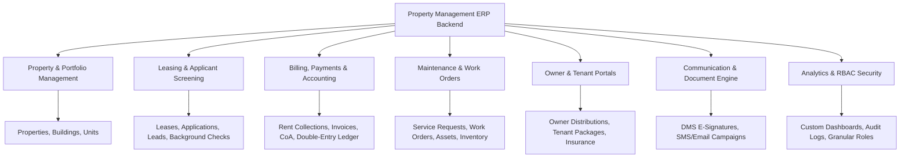

# DoorLoop Property Management ERP - Project Overview

## 1. Executive Summary
The DoorLoop Property Management ERP Backend is a robust, scalable, enterprise-grade RESTful API service engineered to power modern real estate management applications. Built with **Node.js**, **Express.js**, **Prisma ORM**, and **MySQL**, this backend translates all the business workflows, data models, and operational capabilities defined in the frontend `mockApi.ts` into a production-ready server architecture.

The system caters to property managers, real estate owners, leasing agents, maintenance personnel, and tenants by providing specialized portals, financial accounting ledgers, document management workflows, background screening integrations, and dynamic multi-channel communications.

---

## 2. Technology Stack & Architectural Dependencies

| Layer / Concern | Technology Selection | Justification & Purpose |
| :--- | :--- | :--- |
| **Runtime Environment** | Node.js (LTS v20+) | Asynchronous, event-driven, non-blocking I/O execution environment. |
| **Web Framework** | Express.js (v4.x) | Lightweight, unopinionated web framework for HTTP routing and middleware pipelines. |
| **Database & ORM** | MySQL + Prisma ORM | Relational ACID-compliant database paired with type-safe schema modeling, migrations, and query generation. |
| **Authentication & Auth** | JWT (JSON Web Tokens) + `bcrypt` | Stateless access tokens (short-lived) + refresh tokens with hashed password management. |
| **Security & Hardening** | `helmet`, `cors`, `express-rate-limit` | Security header enforcement, Cross-Origin Resource Sharing control, and DDoS/Brute-force rate limiting. |
| **Input Validation** | `zod` / `express-validator` | Strict runtime request body, query parameter, and route parameter validation. |
| **Environment Config** | `dotenv` | Centralized environment variable loading for API keys, DB connection strings, and secrets. |
| **Logging & Telemetry** | `morgan` + `pino` / `winston` | HTTP access request logging paired with structured, log-level structured application logging. |
| **Identifiers** | `uuid` (v4) | Cryptographically secure UUIDs for primary keys and request trace correlation IDs. |

---

## 3. Core Functional Domains & Capabilities



### 3.1. Property & Portfolio Management
- Multi-level hierarchy: Property $\rightarrow$ Building $\rightarrow$ Unit.
- Automated metric rollups: Occupancy Rate %, Monthly Revenue, Total vs Occupied Units.
- Physical address tracking, ownership percentage allocation, and valuation tracking.

### 3.2. Leasing & Applicant Lifecycle
- Lead funnel management: Stages from New to Tour Scheduled, Application Sent, Negotiating, Lease Signed.
- Application processing with rent proposals and background screening (TransUnion mock integration).
- Lease agreements management with security deposit tracking, lease renewals, and termination workflows.

### 3.3. Financial Operations & Double-Entry Accounting
- Rent collection engine with support for ACH, Credit Card, Bank Transfer, Check, and Cash.
- Charge generation, partial payments, automated late fees, security deposit holding & refund calculations.
- Full Chart of Accounts (CoA), Journal Entries with strict Debit = Credit balance validation, and General Ledger tracking.
- Accounts Payable (AP) vendor bills, recurring transaction schedules, property budgets, and Owner Statements.

### 3.4. Maintenance, Asset & Vendor Management
- Tenant service request ticket logging with priority levels.
- Work order generation, vendor dispatch, cost allocations, and invoice generation.
- Maintenance asset tracking (HVAC, Elevators, Roofs), preventive maintenance schedules, and inventory management.
- DOB/Municipal violation management with compliance tracking and fine enforcement.

### 3.5. Owner & Tenant Self-Service Portals
- **Owner Portal**: Distribution statements, monthly payout execution, property performance reports, and direct owner messaging.
- **Tenant Portal**: Online rent payments, maintenance request tracking, visitor logging, package notifications, renters insurance verification, and community announcements.

### 3.6. Communication & Document Management System (DMS)
- Dynamic email/SMS template engine with variable substitution (`{{tenantName}}`, `{{rentAmount}}`).
- Bulk campaign management and direct messaging threads.
- E-signature workflow engine (document templates, signature fields, execution audit trail).
- File storage and version control for property contracts, tax forms, and tenant leases.

### 3.7. System Administration & RBAC Security
- Multi-tenant company/team separation.
- Granular Role-Based Access Control (RBAC) supporting custom permissions: `view`, `create`, `edit`, `delete`, `approve`, `export`.
- User entity assignment overrides for specific properties, buildings, units, and departments.
- Immutable system audit logging and security policy enforcement (MFA, session timeout, IP whitelisting).

---

## 4. Proposed Backend Directory Structure

```
backend/
├── docs/                      # Backend Documentation
│   ├── PROJECT_OVERVIEW.md
│   ├── ARCHITECTURE.md
│   ├── API_CONTRACT.md
│   ├── BUSINESS_RULES.md
│   └── MEMORY.md
├── prisma/                    # Prisma Database Layer
│   ├── schema.prisma          # Database Schema Definition
│   ├── migrations/            # SQL Migration History
│   └── seed.ts                # Database Seeder Script (translating mockApi data)
├── src/
│   ├── config/                # Environment & System Configurations
│   │   ├── database.ts        # Prisma Client Instance
│   │   ├── env.ts             # Zod Validated Environment Variables
│   │   ├── logger.ts          # Pino/Winston Logger Setup
│   │   └── security.ts        # CORS & Helmet Options
│   ├── controllers/           # HTTP Request Handlers
│   │   ├── auth.controller.ts
│   │   ├── property.controller.ts
│   │   ├── unit.controller.ts
│   │   ├── lease.controller.ts
│   │   ├── payment.controller.ts
│   │   ├── accounting.controller.ts
│   │   ├── maintenance.controller.ts
│   │   ├── owner.controller.ts
│   │   ├── tenant.controller.ts
│   │   ├── dms.controller.ts
│   │   └── system.controller.ts
│   ├── middlewares/           # Custom Express Middlewares
│   │   ├── auth.middleware.ts # JWT Verification & User Loading
│   │   ├── rbac.middleware.ts # Modular Permission Enforcer
│   │   ├── validate.middleware.ts # Zod Schema Request Validation
│   │   ├── error.middleware.ts# Global Exception Handler
│   │   ├── requestId.middleware.ts # UUID Correlation ID Injector
│   │   └── rateLimiter.middleware.ts # Rate Limiting Policies
│   ├── routes/                # Express API Route Registries
│   │   ├── index.ts           # Root API Router v1
│   │   ├── auth.routes.ts
│   │   ├── property.routes.ts
│   │   ├── lease.routes.ts
│   │   ├── payment.routes.ts
│   │   ├── accounting.routes.ts
│   │   ├── maintenance.routes.ts
│   │   ├── owner.routes.ts
│   │   ├── tenant.routes.ts
│   │   ├── dms.routes.ts
│   │   └── system.routes.ts
│   ├── services/              # Business Logic Core
│   │   ├── property.service.ts
│   │   ├── payment.service.ts
│   │   ├── ledger.service.ts  # Double-entry balance calculation
│   │   ├── screening.service.ts
│   │   ├── maintenance.service.ts
│   │   ├── owner.service.ts
│   │   └── dms.service.ts
│   ├── utils/                 # Helper Functions & Constants
│   │   ├── apiResponse.ts     # Standardized JSON Payload Formatter
│   │   ├── appError.ts        # Custom Operational Error Class
│   │   └── jwt.ts             # Token Sign/Verify Wrappers
│   ├── validators/            # Zod Validation Schemas
│   │   ├── auth.schema.ts
│   │   ├── property.schema.ts
│   │   ├── payment.schema.ts
│   │   └── workOrder.schema.ts
│   ├── types/                 # TypeScript Express & Custom Types
│   │   └── express.d.ts
│   └── app.ts                 # Express Application Setup
├── .env.example               # Template for Environment Configuration
├── package.json
└── tsconfig.json
```
